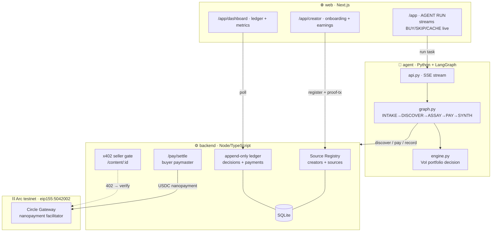
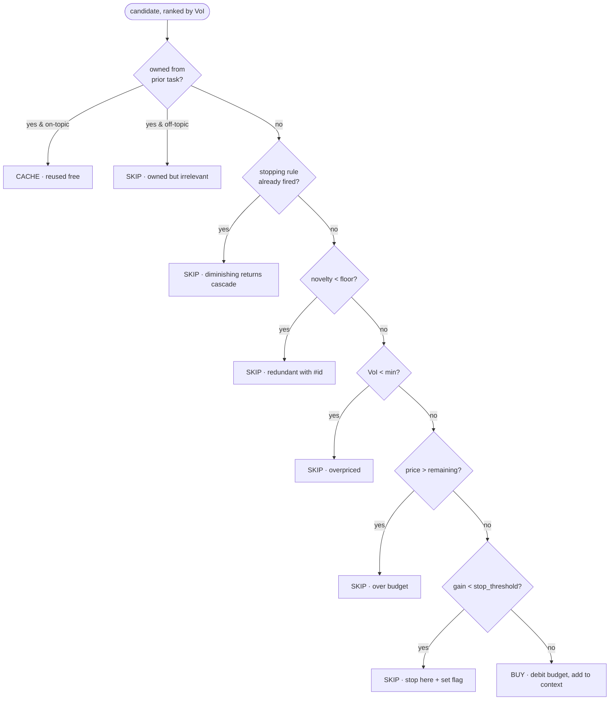
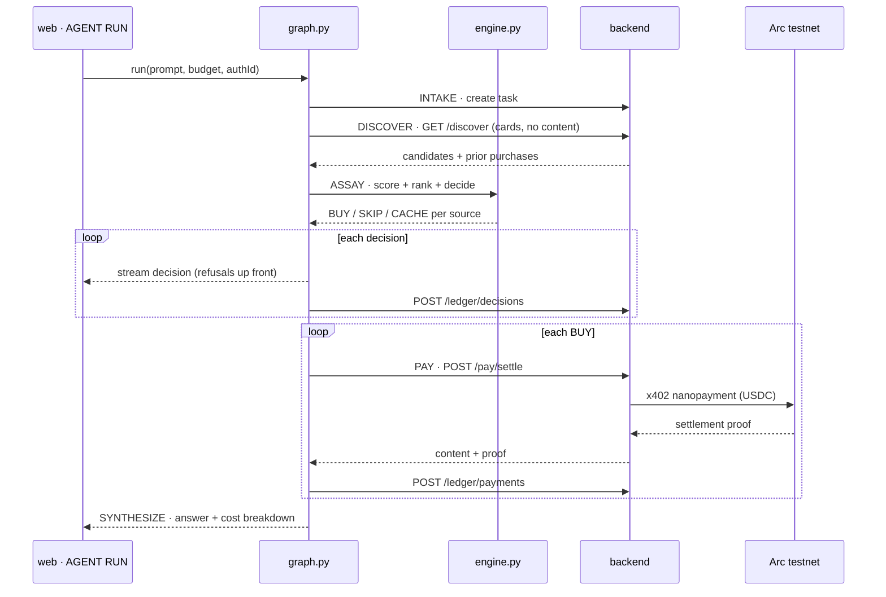
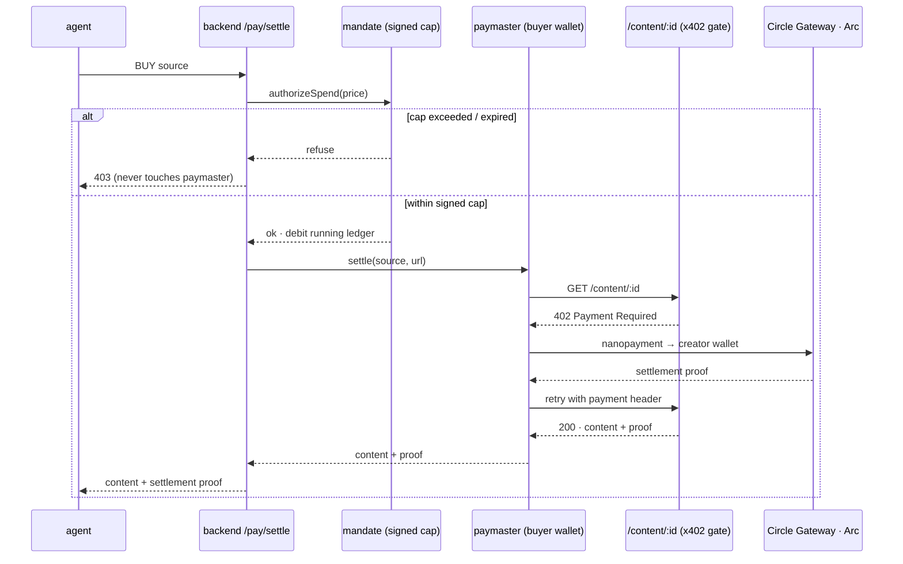
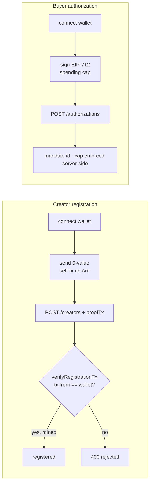

<p align="center">
  
</p>

# Assay — Architecture

> **The spending brain for research agents.** Assay decides *which* creator sources are worth
> buying under a fixed USDC budget, then pays them per use over **x402 + Circle Gateway
> nanopayments** on **Arc testnet** — logging every decision, *especially the refusals*.

This document is the map of the system: what each part does, how data flows, and where the
money actually moves. Prose is kept short; each section leads with a one-liner and then a
diagram. For the *why-it-wins* narrative and metrics, see **[README.md](README.md)**.

---

## 1. The big picture

Three cooperating parts around one SQLite ledger: a Python **agent** that judges and pays, a
Node **backend** that sells content over x402 and records the ledger, and a Next.js **web**
surface that streams it all live.



**Reading it:** the browser kicks off a run → the agent discovers candidate cards, scores
them, and for each `BUY` asks the backend to settle a real nanopayment on Arc → every
decision and payment lands in the ledger → the dashboard reads it back.

---

## 2. Repository layout

One-liner: a monorepo where each top-level directory is one deployable concern.

```
Assay/
├── agent/            🧠 Python spending brain (the crown jewel)
│   └── assay/
│       ├── engine.py     ← VoI portfolio decision engine  (pure, unit-tested)
│       ├── graph.py      ← LangGraph state machine + event stream
│       ├── client.py     ← thin HTTP client to the backend
│       └── embed.py      ← deterministic embeddings + cosine
│   ├── cli.py            ← run one task headless
│   └── api.py            ← stream a run over SSE for the web UI
│
├── backend/          ⚙️ Node/TS registry + x402 seller + ledger
│   └── src/
│       ├── server.ts     ← all HTTP routes
│       ├── x402.ts       ← per-creator 402 seller middleware
│       ├── paymaster.ts  ← funded buyer wallet · real settlement
│       ├── mandate.ts    ← signed spending-cap enforcement
│       ├── arc.ts        ← Arc constants + on-chain proof verify
│       └── db.ts         ← SQLite store
│
├── web/              🌐 Next.js + Tailwind demo surface
│   ├── app/app/          ← run · creator · dashboard · refusals
│   └── lib/wallet.ts     ← browser wallet: proof-tx + EIP-712 cap
│
├── payments-poc/     ✅ step-1 proof: one real USDC nanopayment over x402
└── scripts/          🌱 seed.py (creators + sources + batch), smoke_run.py
```

---

## 3. The decision engine — `agent/assay/engine.py`

One-liner: for each source it computes *value-of-information per dollar*, ranks by it, and
greedily buys until a stopping rule fires — so buying one source can make the next a refusal.

```
relevance     = cosine(embed(task), embed(candidate.abstract))         # topical fit
novelty       = 1 − max(cosine(candidate, b) for b in already_bought)  # overlap penalty
expected_gain = relevance × novelty × quality_prior                    # marginal info
voi           = expected_gain / price                                  # gain per dollar
```

Per candidate, exactly one decision is emitted through this precedence ladder:



**Why the order matters:** a concrete reason (overlap → price → budget) always beats the
generic "diminishing returns" message, so the rationale a reviewer reads is the *real* cause.
The whole policy lives in one small, swappable `AssayConfig`; the module is pure and covered
by `agent/tests/test_engine.py`.

---

## 4. The run — `agent/assay/graph.py`

One-liner: a five-node LangGraph state machine over one shared `RunState`, emitting a
structured event at every step so the UI can render the run as it happens.



Nodes: **INTAKE** (task + budget) → **DISCOVER** (candidate cards only) → **ASSAY** (the
decision above) → **PAY** (settle each BUY over x402) → **SYNTHESIZE** (answer with inline
attribution + "this cost $X, paid N creators, M skipped"). If `langgraph` is absent the graph
falls back to an identical sequential runner, so the demo never breaks.

---

## 5. The money path — x402 + Circle Gateway on Arc

One-liner: buying a source is a real HTTP 402 handshake — the seller gate demands payment,
the buyer paymaster settles a sub-cent USDC nanopayment on Arc, and only then is content
released. Every settlement carries an on-chain proof.



Key properties:
- **The signed cap is the chokepoint.** The buyer signs an EIP-712 `SpendingAuthorization`
  (cap + expiry + nonce) in the browser; the backend enforces it *before* the paymaster runs.
  Calling `/pay/settle` directly cannot exceed the signed cap — and a failed settlement
  **refunds** the reservation so the cap isn't burned by a payment that never happened.
- **Many sellers, one gate factory.** `x402.ts` caches one Gateway middleware per creator
  wallet, so a single endpoint pays whichever creator owns the requested source.
- **Loud, not mocked.** With no funded wallet the path 503s rather than silently faking a
  payment. `ASSAY_MOCK_PAY` / `ASSAY_TEST_SETTLE` exist for dev only, behind explicit flags.

---

## 6. Trust & identity

One-liner: creators prove they control a wallet with a real on-chain self-transaction, and
buyers cap agent spend with a signature — no trust in the UI required.



`backend/src/arc.ts::verifyRegistrationTx` polls Arc (~60s) for the proof-tx to propagate and
mine, then confirms the sender matches the address being registered — so nobody can register
an address they don't own.

---

## 7. Backend API surface

One-liner: a small, honest REST surface — registry writes, one x402-gated content route, an
append-only ledger, and aggregate views for the dashboard.

| Method & path | Purpose |
| --- | --- |
| `POST /creators` | register a creator (verifies on-chain proof-tx) |
| `POST /sources` | register a source; embedding computed server-side |
| `GET  /discover?q=` | candidate cards — metadata + price + embedding, **never content** |
| `GET  /content/:id` | **x402-gated**: 402 unless paid to that creator's wallet |
| `POST /authorizations` | register a browser-signed spending cap → mandate id |
| `POST /pay/settle` | enforce cap → settle real nanopayment → return content + proof |
| `POST /ledger/decisions` | append a BUY/SKIP/CACHE decision + rationale |
| `POST /ledger/payments` | append a settled payment + proof |
| `GET  /payouts` | per-creator aggregate earnings |
| `GET  /metrics` | traction metrics (paid calls, USDC settled, ratios…) |

---

## 8. Circle / Arc stack

| Layer | What it is | Where in code |
| --- | --- | --- |
| **Arc testnet** | settlement chain, `eip155:5042002`, 6-decimal USDC | `backend/src/arc.ts`, `web/lib/arcNetwork.ts` |
| **Circle Gateway** | sub-cent, gas-free, batched nanopayment facilitator | `backend/src/x402.ts`, `paymaster.ts` |
| **x402 protocol** | the `402 Payment Required` flow on every content endpoint | `backend/src/x402.ts` |
| **Circle wallets** | every agent and every creator has one | registry + paymaster |

Payment plumbing was adapted from `circlefin/arc-nanopayments` (paying agent + x402 seller +
Gateway batching) rather than reinvented.

---

## 9. Design decisions (and anti-patterns avoided)

- **Refusals are a first-class output**, streamed and logged — not hidden. Agency is the
  product; `if price < budget: buy` is not.
- **The spending cap lives server-side.** Bypassing the UI cannot overspend.
- **Payments are real or loud.** No silent mocks in the final path.
- **DISCOVER hands the agent every card, unfiltered.** Semantic relevance is ASSAY's job via
  embeddings; a naive substring filter would starve it and spend $0.
- **Scoped honestly.** No "detect reuse across the open web" claims; not a generic
  wallet/SDK dashboard — this is an *application*.

---

*See **[README.md](README.md)** for the traction metrics, the money-shot ratios, and how to
run it locally.*
